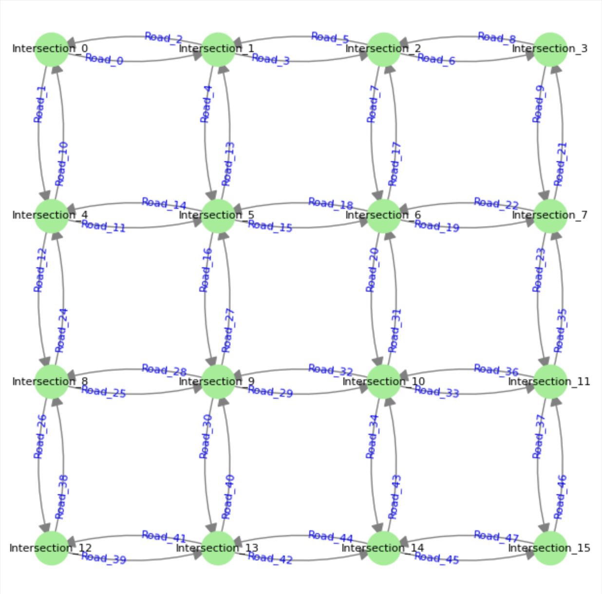

# PyTraffic

A Python simulation model of a traffic intersection implemented with the Mosaik 3.0 framework. This simulation models the behavior of vehicles at intersections, managing traffic lights and vehicle movements based on predefined rules.

## How to run

To run a single simulation, you need to specify the number of intersections per side as a command line argument. Use the provided Bash script to handle setup and execution:

```sh
$ ./run_simulation.sh <number_of_intersections_per_side> <scalability_mode>
```

For example, to run a simulation with a 4x4 grid of intersections without using a scalability technique:

```sh
$ ./run_simulation.sh 4 "no_scaling"
```

The full list of scalability modes available can be found in the file utility/constants.py

### Running benchmark tests

To launch the benchmark tests, the `run_benchmark.sh` script can be used by typing the following command on the console:

```sh
$ ./run_benchmarks.sh <scalability_mode>
```

or simply by running this command through the Makefile:

```sh
$ make test
```

### Generating plots

Once all the benchmark tests have been run, you can generate bar charts in order to visualize the obtained results. To do so run the following command:

```sh
$ ./plot_data.sh <mode>
```

where `mode` is either `low` or `high` depending on the approach tested.

Again, a shortcut command can be used to launch that script:

```sh
$ make plot
```

## Requirements

To install the necessary Python packages, use the following command:

```sh
$ pip install -r requirements.txt
```

## Simulation Models

- **Intersection**: represents a single intersection managing traffic lights for the four cardinal points (north, south, east, west). At each simulation step, it alternates between 'red' light and 'green' light every 10 seconds.
- **Road**: represents a single road connecting two intersections. It holds a queue of vehicles and manages their movement to the next road. To do so, each road also stores an array of adjacent roads along with their relative directions.

  Here's an example of the adjacent roads array for the _Road_0_ entity :

  ```json
  "next_adjacent_roads": [
      { "road": { "eid": "Road_3", ... }, "direction": "straight" }
      { "road": { "eid": "Road_4", ... }, "direction": "right" },
  ]
  ```

  Based on this array and on the next direction of a vehicle, each road knows which road to move the vehicle to and in which direction.
  If there is a road in the direction in which the vehicle wants to go, the vehicle is removed from the queue of the current road and it's added to the queue of the destination road.
  In case no roads for a certain direction are found, the vehicle is considered to be trying to go out-of-bounds. If the vehicle has no more directions, it is considered to have reached its destination. In both these last two cases, the vehicle is removed from the simulation.

- **Vehicle**: represents a single vehicle moving along a road. It holds a list of directions (e.g., 'right', 'left', 'straight') and it is moved accordingly by the roads whenever the respective traffic light is green.

## Simulators

- **IntersectionSim**: time-based simulator that is in charged of stepping all the Intersection entities. This simulator is connected to the Road simulator in order to pass the traffic_lights attribute.
- **RoadSim**: event-based simulator that steps the Road entities each time there is a change in the traffic lights passed by the Intersection to which the road is connected.
- **Collector**: event-based simulator that is used to collect the simulation data of other simulators and print it to the _collected_data.json_ file.

## Scenario

The scenario is represented as a NxN 2d grid of intersections, where N is a parameter given by the user from the command line. The grid is represented as a 2d graph of Intersection entities. The intersections are connected to each other via 2 roads going in opposite directions (north-south, east-west). The vehicles are represented as Vehicle objects and move along the roads. At each step of the simulation (1 second), the state of the intersections, roads, and vehicles is updated accordingly.

On the terminal, the simulation displays which vehicles reach their final destination and which are trying to go out-of-bounds.

## Grid example: 4 nodes per side


